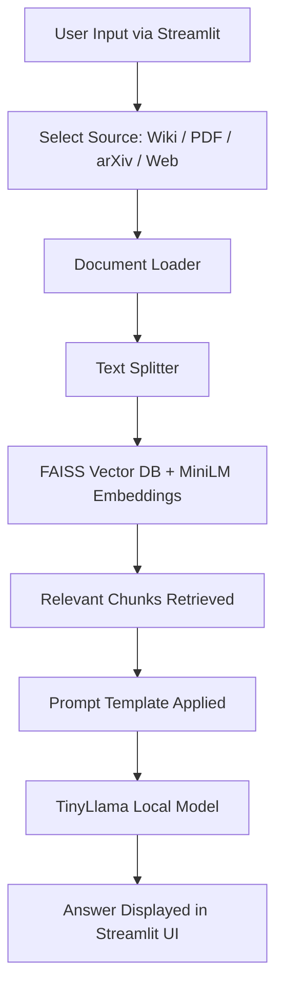
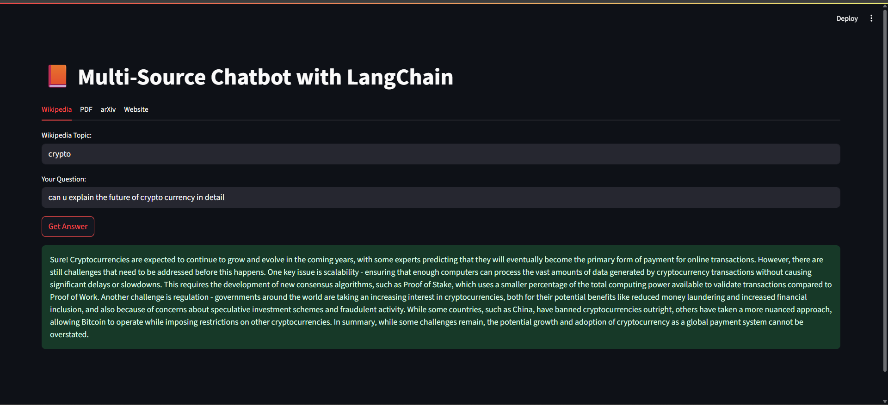
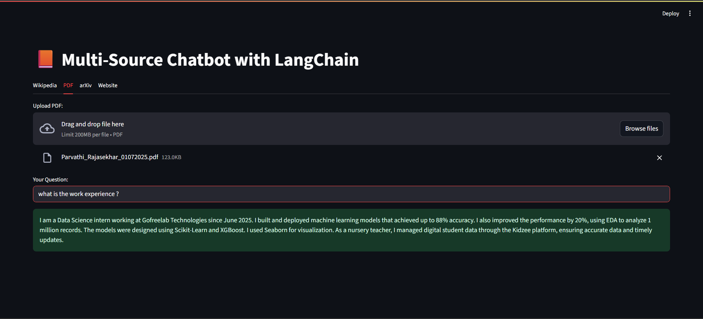
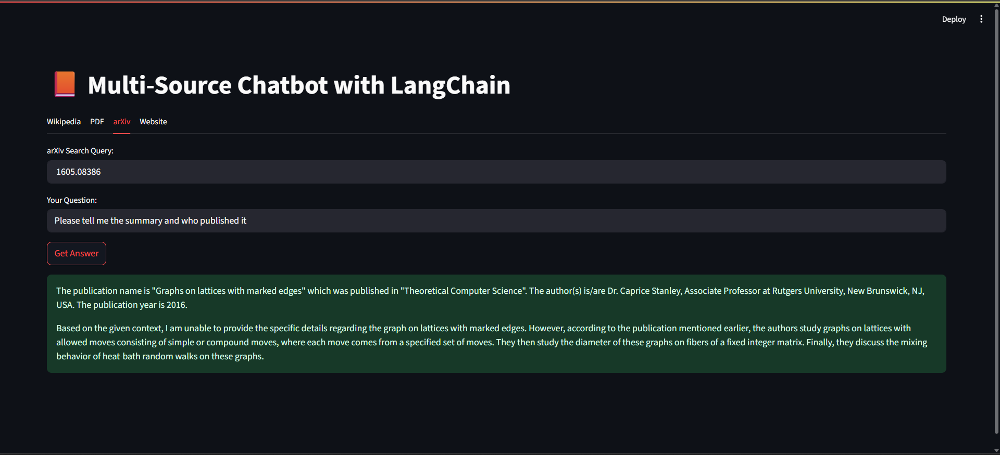
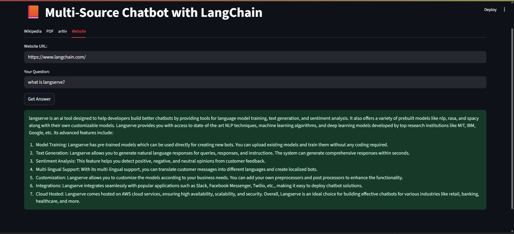

# 🧠 Multi-Source Q&A Chatbot with LangChain + TinyLlama + FAISS


> Ask intelligent questions across multiple sources — all powered **locally** with Hugging Face, FAISS, and LangChain.

---

## ✨ Overview

A fully offline, multi-source chatbot powered by local LLMs and semantic search, built using:

- 🦙 **TinyLlama-1.1B-Chat** for question answering
- 🧠 **MiniLM** for fast and efficient embeddings
- 🔍 **FAISS** for chunk retrieval
- 🛠 **LangChain** to orchestrate everything
- 🎨 **Streamlit** for an elegant UI

---

## 📁 Project Structure

```
LANGCHAIN/
│
├── chatbot/
│   ├── models/
│
├── app.py
├── model_downloader.py
├── temp.pdf
│
├── requirements.txt
├── .env
│
├── venv/
│   ├── etc/
│   ├── Include/
│   ├── Lib/
│   ├── Scripts/
│   ├── share/
│   └── pyvenv.cfg
├── requirements.txt
```


---

## 📚 Supported Sources

| Source     | Description                          |
|------------|--------------------------------------|
| 📚 Wikipedia | Search by topic and query answers    |
| 📄 PDF       | Upload PDF files to extract insights |
| 📜 arXiv     | Search and analyze research papers   |
| 🌐 Website   | Scrape and query content dynamically |

---

## ⚙️ Setup Instructions

### 1. Create a Virtual Environment

```bash
cd Langchain
python -m venv venv
venv\Scripts\activate        # Windows
# OR
source venv/bin/activate     # macOS/Linux
```
### 2.Install Required Packages

```bash
pip install -r chatbot/requirements.txt
```
### 3.Download the Required Models

```bash
python chatbot/model_downloader.py
```
# Downloads and caches:

TinyLlama/TinyLlama-1.1B-Chat-v1.0

sentence-transformers/all-MiniLM-L6-v2

### 4.Run the App

```bash
streamlit run chatbot/app.py
```

### 5.env File

LANGCHAIN_TRACING_V2=false

LANGCHAIN_API_KEY=your_optional_key

LANGSMITH_ENDPOINT="https://api.smith.langchain.com"

LANGSMITH_PROJECT="multisource-chatbot"

USER_AGENT="LangChainBot/1.0"

## 🧭 Architecture Overview

<details>
<summary>🧠 Click to view architecture (Mermaid)</summary>

<br>



</details>


## 📸 Screenshot

Here is a screenshot of the output we get from multiple sources:










## 🧪 Example Use Cases

Gives context for when your chatbot might be helpful, such as:

a.Reading research papers (arXiv)

b.Classifying website data

c.Learning from Wikipedia

d.Extracting knowledge from PDFs

## 📌 Notes

This clarifies:

a.Models are cached locally (TinyLlama + MiniLM)

b.Works offline

c.Only website/arXiv uses internet (for scraping)

## 📜 License
MIT License © 2025 [Parvathi Vishnu]


